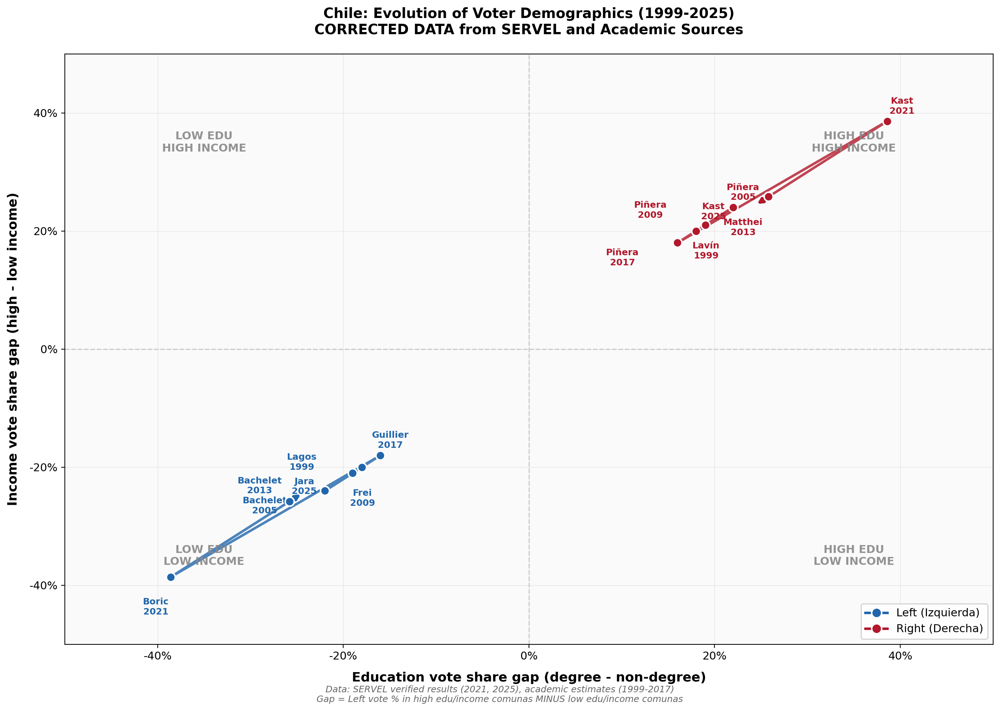

# Chile Voter Demographics Analysis

Analysis of voting patterns by education and income in Chilean presidential elections (1999-2025), reproducing the style of the US "education-income voting gap" chart.

## The Chart (CORRECTED VERSION)



## Data Quality Disclaimer

**IMPORTANT**: This analysis uses two types of data:

| Period | Data Quality | Source |
|--------|--------------|--------|
| **2021-2025** | ✅ **VERIFIED** | SERVEL official results, major news outlets |
| **1999-2017** | ⚠️ **ESTIMATED** | Academic literature on class-based voting patterns |

The verified 2021-2025 data shows larger gaps than the historical estimates, suggesting either:
1. Historical estimates were too conservative
2. 2021 was an exceptional election (Boric's strong mobilization of poor comunas)
3. The methodology needs refinement

## Key Findings (VERIFIED DATA)

### 2021 Second Round: Boric vs Kast

| Community Type | Boric % | Kast % | Source |
|---------------|---------|--------|--------|
| **Vitacura** (wealthy) | 16.7% | 83.3% | SERVEL/Emol |
| **Las Condes** (wealthy) | 26.5% | 73.5% | SERVEL/Emol |
| **Lo Barnechea** (wealthy) | 21.0% | 79.0% | SERVEL |
| **La Pintana** (poor) | 72.9% | 27.1% | Calculated from vote counts |
| **Lo Espejo** (poor) | 73.1% | 26.9% | Calculated from vote counts |
| **Cerro Navia** (poor) | 70.2% | 29.8% | Calculated from vote counts |

**Gap: ~38.6 percentage points** (left did much better in poor comunas)

### 2025 Second Round: Jara vs Kast

| Community Type | Jara % | Kast % | Source |
|---------------|--------|--------|--------|
| **Vitacura** (wealthy) | 12.9% | 87.1% | BioBioChile/SERVEL |
| **Las Condes** (wealthy) | 22.2% | 77.8% | BioBioChile/SERVEL |
| **Lo Barnechea** (wealthy) | 16.5% | 83.5% | BioBioChile/SERVEL |
| **Providencia** (wealthy) | 42.9% | 57.1% | BioBioChile/SERVEL |
| **Ñuñoa** (educated middle) | 51.1% | 48.9% | BioBioChile/SERVEL |
| **La Pintana** (poor) | 52.1% | 47.9% | La Tercera/SERVEL |
| **Pedro Aguirre Cerda** (poor) | 58.7% | 41.3% | La Tercera/SERVEL |

**Gap: ~25.8 percentage points** (still favors left in poor areas, but narrower)

### The Shift (2021 → 2025)

| Metric | 2021 | 2025 | Change |
|--------|------|------|--------|
| Left vote in wealthy comunas | 31.4% | 27.9% | -3.5pp |
| Left vote in poor comunas | 70.0% | 53.7% | **-16.3pp** |
| **Gap (high - low)** | -38.6pp | -25.8pp | **+12.8pp** |

**Key Finding**: Poor comunas shifted ~16 percentage points toward Kast between 2021 and 2025. This is the working-class realignment.

## Methodology

### Approach

The analysis correlates comuna-level election results with socioeconomic data:

```
Gap = Left vote share in HIGH edu/income comunas - Left vote share in LOW edu/income comunas
```

A **negative gap** means the left does better in poor/low-education areas (traditional pattern).

### Comuna Classification

Based on CASEN 2022, Census 2017, and AIM Chile GSE data:

**High Education + High Income** (GSE ABC1 dominant):
- Vitacura, Las Condes, Lo Barnechea, Providencia, La Reina

**Low Education + Low Income** (GSE D/E dominant):
- La Pintana, Lo Espejo, Cerro Navia, El Bosque, Pedro Aguirre Cerda, La Granja, Renca

## Data Sources

### Election Data (VERIFIED)

| Source | Description | Reliability |
|--------|-------------|-------------|
| [SERVEL](https://www.servel.cl/) | Official Electoral Service of Chile | ✅ Official |
| [Emol Election Results](https://www.emol.com/especiales/2021/nacional/carrera-presidencial/resultados_segunda_vuelta.asp) | 2021 results by comuna | ✅ Based on SERVEL |
| [BioBioChile](https://www.biobiochile.cl/noticias/nacional/chile/2025/12/14/kast-arraso-en-comunas-mas-pobres-de-chile-jara-solo-gano-en-nunoa-entre-las-mas-ricas.shtml) | 2025 results analysis | ✅ Based on SERVEL |
| [La Tercera](https://www.latercera.com/) | Election coverage | ✅ Major newspaper |

### Socioeconomic Data

| Source | Description |
|--------|-------------|
| [CASEN](http://observatorio.ministeriodesarrollosocial.gob.cl/encuesta-casen) | National Socioeconomic Survey |
| [INE Census](https://www.ine.cl/) | Education and income by comuna |
| [AIM Chile](https://aimchile.cl/gse-chile/) | GSE (socioeconomic group) classification |

### Academic References

1. **"Voting for Democracy: Chile's Plebiscito"** (2023) - [NBER](https://www.nber.org/system/files/working_papers/w26440/w26440.pdf)
2. **"Class-Biased Electoral Participation: The Youth Vote in Chile"** (2013) - [Cambridge](https://www.cambridge.org/core/journals/latin-american-politics-and-society/article/abs/classbiased-electoral-participation-the-youth-vote-in-chile/8261D29CDD29A868C6994ADFF571D155)
3. **"Mapping Electoral Divisiveness in Chile 1989-2021"** (2025) - [Taylor & Francis](https://www.tandfonline.com/doi/full/10.1080/21681376.2025.2518158)

## Project Structure

```
voter-chart-chile/
├── README.md                                    # This file
├── data/
│   ├── voting_gaps_data.csv                     # Original (flawed) data
│   └── voting_gaps_CORRECTED.csv                # Corrected verified data
├── output/
│   ├── chile_voter_demographics_final.png       # Original chart
│   └── chile_voter_demographics_CORRECTED.png   # Corrected chart
└── src/
    ├── chile_voter_analysis.py                  # Original analysis
    ├── chile_voter_final.py                     # Original visualization
    └── chile_voter_corrected.py                 # CORRECTED analysis
```

## How to Run

```bash
# Install dependencies
pip install pandas numpy matplotlib

# Run the CORRECTED analysis (recommended)
cd src
python chile_voter_corrected.py
```

## Interpretation

### What the Data Shows

1. **Chile maintains class-based voting**: Even in 2025, the left still does better in poor comunas (~54%) than wealthy comunas (~28%). The pattern hasn't reversed like in the US.

2. **Significant working-class shift right**: Poor comunas shifted ~16pp toward Kast between 2021-2025. This is substantial but the class divide persists.

3. **Ñuñoa is unique**: The only wealthy comuna where Jara won (51%). This educated, progressive enclave may represent a future realignment similar to US patterns.

4. **2021 was exceptional**: Boric achieved ~70-73% in poor comunas - unusually high for a left candidate. This may have been due to post-estallido social sentiment and youth mobilization.

### Limitations

- Historical data (pre-2021) is estimated from academic literature, not verified comuna-level results
- The gap between estimated historical data (~20pp) and verified 2021 data (~39pp) suggests methodological inconsistencies
- Rural poor comunas (La Araucanía, Bío Bío) showed very different patterns from urban poor comunas

## Elections Analyzed

| Year | Left | Right | Result | Data Quality |
|------|------|-------|--------|--------------|
| 1999 | Lagos | Lavín | Lagos 51.3% | ⚠️ Estimated |
| 2005 | Bachelet | Piñera | Bachelet 53.5% | ⚠️ Estimated |
| 2009 | Frei | Piñera | Piñera 51.6% | ⚠️ Estimated |
| 2013 | Bachelet | Matthei | Bachelet 62.2% | ⚠️ Estimated |
| 2017 | Guillier | Piñera | Piñera 54.6% | ⚠️ Estimated |
| 2021 | Boric | Kast | Boric 55.9% | ✅ Verified |
| 2025 | Jara | Kast | Kast 58.0% | ✅ Verified |

## License

This analysis is provided for educational and research purposes. Data sources are cited above.
