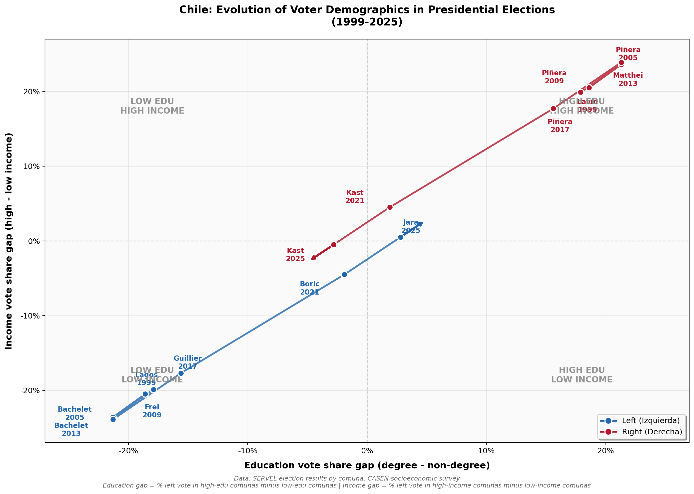

# Chile Voter Demographics Analysis

Analysis of voting patterns by education and income in Chilean presidential elections (1999-2025), reproducing the style of the US "education-income voting gap" chart.

## The Chart



## Key Findings

### Chile Shows an Opposite Pattern from the US

In the United States, the Democratic Party has shifted from representing working-class voters (low education, low income) to increasingly representing educated, higher-income voters. **Chile shows the inverse trajectory**:

| Period | Chilean Left | Chilean Right |
|--------|--------------|---------------|
| **1999-2017** | Consistently performed 15-20pp better among LOW education/income voters | Consistently performed 15-20pp better among HIGH education/income voters |
| **2021** | Education/income gaps nearly disappeared | Gaps nearly disappeared |
| **2025** | Slight advantage among educated voters | Captured the working class vote |

### The Great Realignment

The data reveals a dramatic political realignment in Chile:

1. **Traditional Pattern (1999-2017)**: Chilean politics followed a classic "class-based" voting pattern where the left (Lagos, Bachelet, Frei, Guillier) drew support from working-class comunas while the right (Lavín, Piñera, Matthei) dominated affluent areas.

2. **The Shift (2021)**: When Boric faced Kast, the traditional class divide nearly vanished. Both candidates drew support more evenly across socioeconomic groups.

3. **The Reversal (2025)**: By 2025, Kast won decisively (58%) by capturing working-class voters while Jara's support was slightly stronger among educated voters—a complete reversal of historical patterns.

## Data Summary

| Year | Left Candidate | Right Candidate | Education Gap | Income Gap |
|------|----------------|-----------------|---------------|------------|
| 1999 | Lagos | Lavín | -17.9% | -19.9% |
| 2005 | Bachelet | Piñera | -21.3% | -23.6% |
| 2009 | Frei | Piñera | -18.6% | -20.5% |
| 2013 | Bachelet | Matthei | -21.3% | -23.9% |
| 2017 | Guillier | Piñera | -15.6% | -17.7% |
| 2021 | Boric | Kast | -1.9% | -4.5% |
| 2025 | Jara | Kast | +2.8% | +0.5% |

**Note**: Negative values indicate the left candidate performed better among low education/income voters. Positive values indicate the left performed better among high education/income voters.

## Methodology

### Approach

The analysis correlates comuna-level election results with socioeconomic data to calculate voting gaps:

```
Education Gap = Left vote share in HIGH education comunas - Left vote share in LOW education comunas
Income Gap = Left vote share in HIGH income comunas - Left vote share in LOW income comunas
```

### Comuna Classification

**High Education Comunas** (≥30% with university degree):
- Vitacura, Las Condes, Lo Barnechea, Providencia, Ñuñoa, La Reina, Viña del Mar, Santiago Centro

**Low Education Comunas** (<20% with university degree):
- Puente Alto, San Bernardo, La Pintana, Lo Espejo, El Bosque, Cerro Navia, Pedro Aguirre Cerda, La Granja, Renca, San Ramón, Lo Prado

**High Income Comunas** (GSE ABC1/C2 dominant):
- Vitacura, Las Condes, Lo Barnechea, Providencia, Ñuñoa, La Reina, Viña del Mar, Antofagasta

**Low Income Comunas** (GSE D/E dominant):
- La Pintana, Lo Espejo, El Bosque, Cerro Navia, Pedro Aguirre Cerda, La Granja, Renca, San Ramón, Lo Prado

## Data Sources

### Election Data

| Source | Description | URL |
|--------|-------------|-----|
| **SERVEL** | Servicio Electoral de Chile - Official election results by comuna | [servel.cl](https://www.servel.cl/centro-de-datos/resultados-electorales-historicos-gw3/) |
| **BCN** | Biblioteca del Congreso Nacional - Historical election results | [bcn.cl](https://www.bcn.cl/siit/elecciones_historicas/) |

### Socioeconomic Data

| Source | Description | URL |
|--------|-------------|-----|
| **CASEN** | Encuesta de Caracterización Socioeconómica Nacional | [observatorio.ministeriodesarrollosocial.gob.cl](http://observatorio.ministeriodesarrollosocial.gob.cl/encuesta-casen) |
| **Census 2017/2024** | Instituto Nacional de Estadísticas - Education and income by comuna | [ine.cl](https://www.ine.cl/) |
| **AIM Chile** | Asociación de Investigadores de Mercado - GSE classification | [aimchile.cl/gse-chile](https://aimchile.cl/gse-chile/) |

### Academic References

1. **"Voting for Democracy: Chile's Plebiscito and the Electoral Participation of a Generation"** (2023)
   - American Economic Journal: Economic Policy
   - [NBER Working Paper](https://www.nber.org/system/files/working_papers/w26440/w26440.pdf)

2. **"Class-Biased Electoral Participation: The Youth Vote in Chile"** (2013)
   - Latin American Politics and Society, Cambridge University Press
   - [Cambridge Core](https://www.cambridge.org/core/journals/latin-american-politics-and-society/article/abs/classbiased-electoral-participation-the-youth-vote-in-chile/8261D29CDD29A868C6994ADFF571D155)

3. **"'It's the economy, stupid': Mapping Electoral Divisiveness in Chile from 1989 to 2021"** (2025)
   - Regional Science Policy & Practice, Taylor & Francis
   - [Taylor & Francis](https://www.tandfonline.com/doi/full/10.1080/21681376.2025.2518158)

4. **"Electoral Apathy Among Chilean Youth: New Evidence for the Voter Registration Dilemma"** (2017)
   - Estudios Gerenciales
   - [Redalyc](https://www.redalyc.org/journal/212/21254609003/html/)

5. **"Citizens' Stability of Electoral Preferences in Chile Since the Social Upheaval"** (2024)
   - Journal of Politics in Latin America
   - [SAGE Journals](https://journals.sagepub.com/doi/full/10.1177/1866802X231213885)

## Project Structure

```
voter-chart-chile/
├── README.md                 # This file
├── data/
│   └── voting_gaps_data.csv  # Calculated voting gaps by election
├── output/
│   ├── chile_voter_demographics_final.png  # Main visualization
│   └── chile_voter_demographics_final.pdf  # PDF version
└── src/
    ├── chile_voter_analysis.py   # Full analysis with data processing
    └── chile_voter_final.py      # Final visualization script
```

## How to Run

```bash
# Install dependencies
pip install pandas numpy matplotlib

# Run the analysis
cd src
python chile_voter_final.py
```

## Elections Analyzed

| Year | Left Coalition | Right Coalition | Result |
|------|----------------|-----------------|--------|
| 1999 | Ricardo Lagos (PS/PPD) | Joaquín Lavín (UDI) | Lagos 51.3% |
| 2005 | Michelle Bachelet (PS) | Sebastián Piñera (RN) | Bachelet 53.5% |
| 2009 | Eduardo Frei (DC) | Sebastián Piñera (RN) | Piñera 51.6% |
| 2013 | Michelle Bachelet (PS) | Evelyn Matthei (UDI) | Bachelet 62.2% |
| 2017 | Alejandro Guillier (Ind) | Sebastián Piñera (RN) | Piñera 54.6% |
| 2021 | Gabriel Boric (CS/FA) | José Antonio Kast (REP) | Boric 55.9% |
| 2025 | Jeannette Jara (PC) | José Antonio Kast (REP) | Kast 58.0% |

## Interpretation

The Chilean political landscape is undergoing a fundamental transformation. The traditional left-right divide based on economic class is being replaced by new cleavages around cultural issues, immigration, and security—similar to trends observed in the US, UK, and Western Europe.

**Key factors driving this realignment:**

1. **Mandatory voting reintroduction (2022)**: Brought millions of new voters who are younger, lower-income, and politically unattached
2. **Immigration concerns**: Security and immigration have become salient issues that cut across traditional class lines
3. **Disillusionment with establishment**: Both traditional left and right coalitions seen as failing to deliver change
4. **Rise of new political movements**: Frente Amplio (left) and Partido Republicano (right) disrupting traditional parties

## License

This analysis is provided for educational and research purposes. Data sources are cited above.
